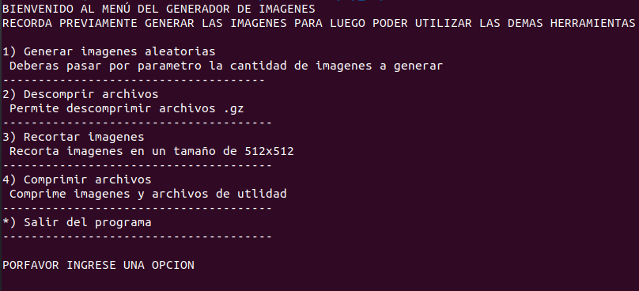

## Trabajo Práctico Entorno de la Programación

---

Trabajo prático realizado por los alumnos Virginia Carrizo Bello y Octavio Fernandez, para la materia Entorno de la Programación de la Tecnicatura Universitaria en Inteligencia Artificial de la UNR.
Los usuarios de este programa podrán generar, comprimir y editar imágenes, ejecutando un contenedor (Docker) como entorno de ejecución.

## Modo de uso

-Construcción y ejecución.

El primer paso a realizar es construtir la imagen de Docker:docker build -t dockerfile {/ruta donde se almacenará la imagen} 

El segundo paso es ejecutar el contenedor:
docker run -it dockerfile

Una vez que  el contenedor este corriendo se podrá ver el siguente menú:

- Opción 1 del menú:

Ejecuta el script "generar.sh" el cual genera imágenes aleatorias utilizando el servicio web https://thispersondoesnotexist.com/.
El script recibe como argumento la cantidad de imágenes a generar y a cada imagen generada se le asigna un nombre del dataset https://raw.githubusercontent.com/adalessandro/EdP-2023-TP-Final/main/dict.csv.
Finalmente, comprime las imágenes generadas en un archivo .tar.gz y crea su correspondiente suma de verificación.

- Opción 2 del menú:

Ejecuta el script "descomprimir.sh" el cual recibe como argumento un archivo .tar.gz y una suma de verificación. Si los archivos ingresados son correctos, descomprime el archivo comprimido y muestra por pantalla el contenido.

- Opción 3 del menú:

Ejecuta el script "procesar.sh" el cual recibe como argumento el nombre de la imagen a procesar, recorta sólo aquellas imágenes cuyos nombres sean válidos (entiendase como nombres de personas válidos a cualquier combinación de palabras que comiencen con letra mayúscula y sigan con minúscula) a una resolución de 512x512 con la utlidad "ImageMagick".

- Opción 4 del menú:

Ejecuta el script "comprimir.sh" el cual genera un archivo con la lista de nombres de todas las imágenes generadas, un archivo con la lista de nombre válidos y un archivo con el total de personas cuyo nombre termine con la letra "a". Por último, comprime los 3 archivos anteriores y todas las imágenes generadas.

Fuera del contenedor, utilice el siguente comando para guardar éste archivo comprimido en su local:
docker cp 727ea5f66d2c:/arch_comp.tar.gz {/ruta_local}

Por cualquier consulta/mejora dejamos nuestros correos electrónicos:

-virginia.carrizo.bello@gmail.com
-fernandez.octavio.ismael@gmail.com

Gracias por leer! 
Saludos.

